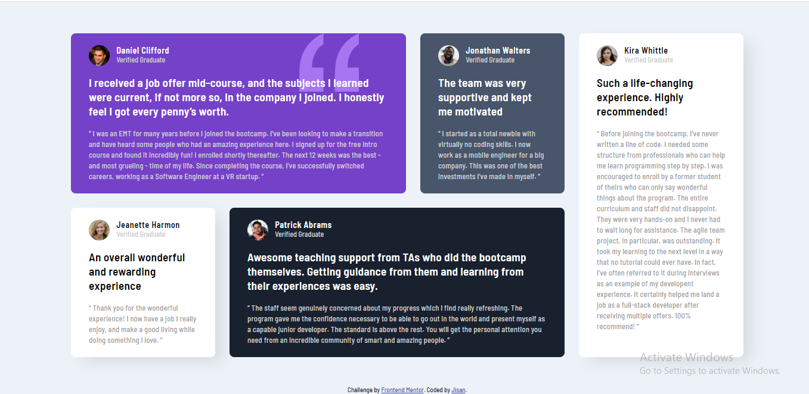

# Frontend Mentor - Testimonials grid section

This is a solution to the [Testimonials grid section challenge on Frontend Mentor](https://www.frontendmentor.io/challenges/testimonials-grid-section-Nnw6J7Un7). Frontend Mentor challenges help you improve your coding skills by building realistic projects. 

## Table of contents

- [Frontend Mentor - Testimonials grid section](#frontend-mentor---testimonials-grid-section)
  - [Table of contents](#table-of-contents)
  - [Overview](#overview)
    - [The challenge](#the-challenge)
    - [Screenshot](#screenshot)
    - [Links](#links)
  - [My process](#my-process)
    - [Built with](#built-with)
    - [Useful resources](#useful-resources)
  - [Author](#author)

## Overview

### The challenge

Users should be able to:

- View the optimal layout for the component depending on their device's screen size
- See a hover state on desktop for the Sign Up call-to-action

### Screenshot

### Links

- Solution URL: [Github](https://github.com/Jisan-mia/flex-testimonial)
- Live Site URL: [Live](https://jisan-mia.github.io/flex-testimonial)

## My process

### Built with

- Semantic HTML5 markup
- CSS custom properties
- CSS Flexbox

### Useful resources

- [https://yoksel.github.io/flex-cheatsheet/](https://yoksel.github.io/flex-cheatsheet/)
- [MDN Flexbox](https://developer.mozilla.org/en-US/docs/Learn/CSS/CSS_layout/Flexbox)

## Author

- Website - [github.com/Jisan-mia](https://www.github.com/Jisan-mia)
- Frontend Mentor - [@Jisan-mia](https://www.frontendmentor.io/profile/Jisan-mia)
- Twitter - [@JisanMia4](https://www.twitter.com/JisanMia4)
